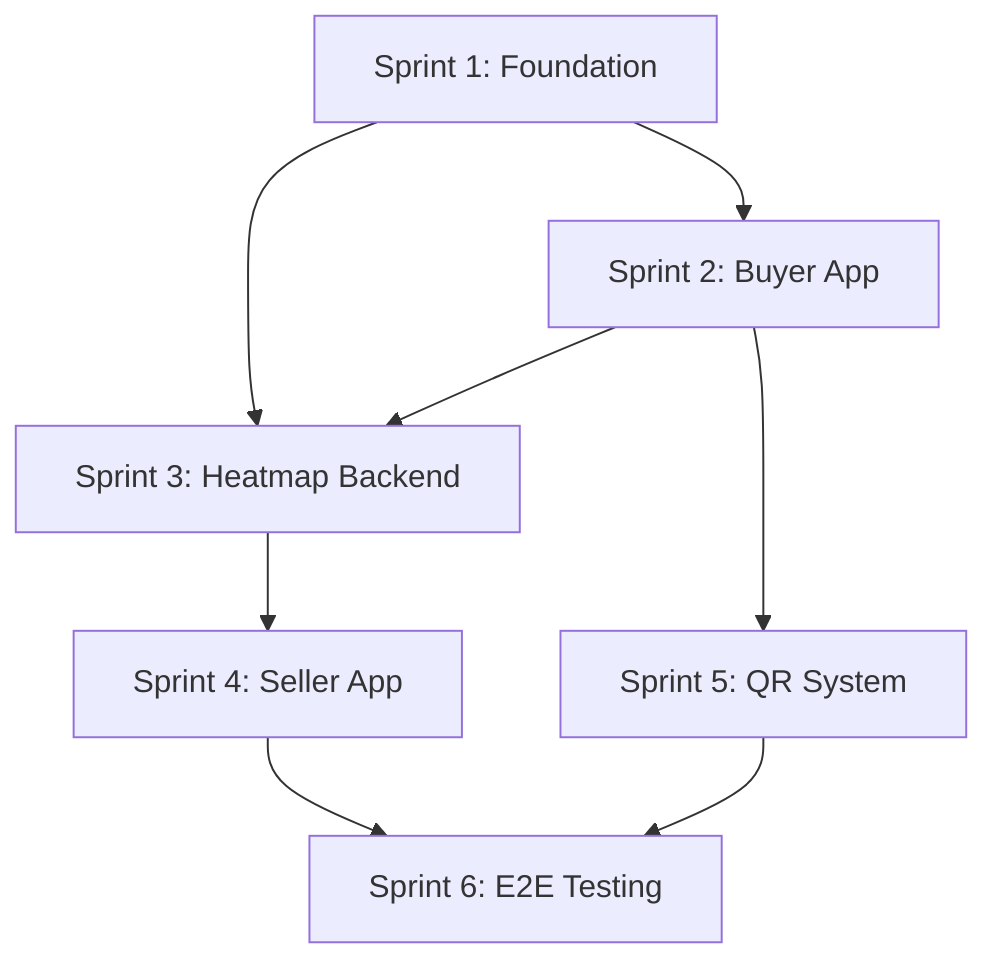

# IMPL-01: Sprint Plan - Frictionless Implementation Roadmap

## Executive Summary

This document outlines the six-sprint implementation roadmap for delivering the Frictionless MVP. It sequences infrastructure, core product features, and operational readiness to reach market launch.

It should be used as the baseline plan and updated after each sprint retrospective.
## Overview

This document outlines the 6-sprint implementation plan for the Frictionless Phygital Shopping ecosystem. Each sprint is designed to build incrementally toward a fully functional MVP.

**Project Philosophy:** "Zero Friction" | "Postgres for Everything"

---

## Sprint 1: Foundation - SST Init + Neon DB + Auth

### Objectives
- Establish the monorepo structure with SST v3
- Configure Neon DB with PostGIS extension
- Implement authentication system

### Deliverables

| Task | Description | Priority |
|------|-------------|----------|
| **1.1** Monorepo Setup | Initialize pnpm workspace with `apps/` and `packages/` structure | P0 |
| **1.2** SST v3 Configuration | Configure `sst.config.ts` with AWS credentials and staging environments | P0 |
| **1.3** Neon DB Provisioning | Create Neon project, configure connection pooling | P0 |
| **1.4** PostGIS Enablement | Enable PostGIS extension: `CREATE EXTENSION postgis;` | P0 |
| **1.5** Database Schema | Design and migrate core tables: `users`, `locations`, `coupons`, `redemptions` | P0 |
| **1.6** Auth API | Implement `/auth/register`, `/auth/login`, `/auth/refresh` endpoints | P0 |
| **1.7** JWT Infrastructure | Configure access/refresh token generation with proper expiry | P1 |

### Technical Notes

```sql
-- Core location table with PostGIS
CREATE TABLE user_locations (
  id UUID PRIMARY KEY DEFAULT gen_random_uuid(),
  user_id UUID REFERENCES users(id),
  location GEOGRAPHY(POINT, 4326) NOT NULL,
  recorded_at TIMESTAMPTZ DEFAULT NOW(),
  accuracy_meters FLOAT
);

-- Spatial index for efficient queries
CREATE INDEX idx_user_locations_geo ON user_locations USING GIST(location);
```

### Exit Criteria
- [ ] `pnpm dev` starts local SST environment
- [ ] Neon DB accessible with PostGIS queries working
- [ ] Auth endpoints return valid JWTs
- [ ] Database migrations run successfully

---

## Sprint 2: Buyer App - Location Tracking + Mapbox

### Objectives
- Build Buyer mobile app shell with Expo
- Integrate Mapbox for map display
- Implement foreground location tracking
- Create location submission endpoint

### Deliverables

| Task | Description | Priority |
|------|-------------|----------|
| **2.1** Expo Project Init | Create `apps/buyer-app` with TypeScript template | P0 |
| **2.2** Mapbox Integration | Install and configure `@rnmapbox/maps` | P0 |
| **2.3** Location Permissions | Implement permission flow for foreground location | P0 |
| **2.4** Location Tracking Service | Build service to capture GPS updates | P0 |
| **2.5** POST /location Endpoint | API to receive and store location updates | P0 |
| **2.6** Batched Location Sync | Queue locations locally, sync in batches | P1 |
| **2.7** Map UI | Display user's current position on map | P1 |

### Technical Notes

```typescript
// Location tracking configuration
const LOCATION_CONFIG = {
  accuracy: Location.Accuracy.Balanced,
  distanceInterval: 10, // meters
  timeInterval: 5000,   // milliseconds
};

// POST /location payload
interface LocationPayload {
  latitude: number;
  longitude: number;
  accuracy: number;
  timestamp: string;
}
```

### Exit Criteria
- [ ] Buyer app displays map with current location
- [ ] Location updates sent to API every 5-10 seconds while moving
- [ ] Location data persists in Neon DB with valid coordinates
- [ ] App handles permission denial gracefully

---

## Sprint 3: Backend Heatmap Generation

### Objectives
- Build PostGIS queries for spatial aggregation
- Create heatmap data endpoint
- Optimize for real-time performance

### Deliverables

| Task | Description | Priority |
|------|-------------|----------|
| **3.1** Heatmap Query Design | PostGIS query to aggregate locations into cell buckets | P0 |
| **3.2** GET /heatmap Endpoint | Return GeoJSON-formatted heatmap data | P0 |
| **3.3** Time Window Filtering | Only include locations from last N minutes | P0 |
| **3.4** Bounding Box Support | Filter by viewport coordinates | P1 |
| **3.5** Query Optimization | Add indexes, tune query performance | P1 |
| **3.6** Caching Layer | Implement short-TTL cache for heatmap results | P2 |

### Technical Notes

```sql
-- Heatmap query: aggregate users into cell buckets
SELECT
  ROUND(ST_Y(location::geometry)::numeric, 4) as lat_cell,
  ROUND(ST_X(location::geometry)::numeric, 4) as lng_cell,
  COUNT(DISTINCT user_id) as user_count
FROM user_locations
WHERE recorded_at > NOW() - INTERVAL '5 minutes'
  AND ST_Within(
    location::geometry,
    ST_MakeEnvelope($1, $2, $3, $4, 4326)
  )
GROUP BY lat_cell, lng_cell;
```

### Exit Criteria
- [ ] `/heatmap` returns valid GeoJSON
- [ ] Response time < 200ms for typical viewport
- [ ] Data reflects only recent locations (5-minute window)
- [ ] Endpoint handles empty results gracefully

---

## Sprint 4: Seller App - Heatmap Display + Polling

### Objectives
- Build Seller (Shadow) mobile app
- Integrate Mapbox heatmap layer
- Implement 30-second polling mechanism

### Deliverables

| Task | Description | Priority |
|------|-------------|----------|
| **4.1** Expo Project Init | Create `apps/seller-app` with TypeScript template | P0 |
| **4.2** Mapbox Heatmap Layer | Configure heatmap visualization | P0 |
| **4.3** Polling Service | Fetch heatmap data every 30 seconds | P0 |
| **4.4** Visual Refresh | Smooth transition when heatmap updates | P1 |
| **4.5** Seller Authentication | Login flow for seller accounts | P0 |
| **4.6** Store Location Marker | Display seller's store position | P1 |
| **4.7** User Count Display | Show total nearby users | P2 |

### Technical Notes

```typescript
// Polling configuration
const POLLING_INTERVAL_MS = 30_000;

// Heatmap layer configuration for Mapbox
const heatmapLayerStyle = {
  heatmapIntensity: ['interpolate', ['linear'], ['zoom'], 0, 1, 15, 3],
  heatmapRadius: ['interpolate', ['linear'], ['zoom'], 0, 2, 15, 20],
  heatmapWeight: ['get', 'user_count'],
  heatmapColor: [
    'interpolate', ['linear'], ['heatmap-density'],
    0, 'rgba(0,0,255,0)',
    0.2, 'royalblue',
    0.4, 'cyan',
    0.6, 'lime',
    0.8, 'yellow',
    1, 'red'
  ]
};
```

### Exit Criteria
- [ ] Seller app displays live heatmap
- [ ] Heatmap refreshes every 30 seconds without flicker
- [ ] Seller can see their store location on map
- [ ] App handles network errors with retry logic

---

## Sprint 5: Dynamic QR - SafeColor Verification

### Objectives
- Implement QR code generation with dynamic color codes
- Build QR scanning functionality
- Create redemption validation flow

### Deliverables

| Task | Description | Priority |
|------|-------------|----------|
| **5.1** QR Generation Logic | Generate unique redemption codes | P0 |
| **5.2** Dynamic Color System | Time-based color code generation | P0 |
| **5.3** QR Display (Buyer) | Show QR with animated color border | P0 |
| **5.4** QR Scanner (Seller) | Camera-based QR scanning | P0 |
| **5.5** Color Verification UI | Seller confirms matching color | P0 |
| **5.6** POST /redeem Endpoint | Validate and record redemption | P0 |
| **5.7** Redemption History | Track redemption status in DB | P1 |

### Technical Notes

```typescript
// Dynamic color rotation (changes every 10 seconds)
const COLOR_PALETTE = ['#FF6B6B', '#4ECDC4', '#45B7D1', '#96CEB4', '#FFEAA7', '#DDA0DD'];

function getCurrentColor(): string {
  const epoch = Math.floor(Date.now() / 10000); // 10-second windows
  return COLOR_PALETTE[epoch % COLOR_PALETTE.length];
}

// QR payload structure
interface QRPayload {
  redemptionId: string;
  couponId: string;
  userId: string;
  timestamp: number;
  colorIndex: number;
}
```

### Exit Criteria
- [ ] Buyer can display QR with color border
- [ ] Seller can scan QR and verify color match
- [ ] Redemption records created in database
- [ ] Invalid/expired QRs rejected properly

---

## Sprint 6: End-to-End Testing + Field Validation

### Objectives
- Comprehensive integration testing
- Field testing in real-world conditions
- Performance optimization and bug fixes

### Deliverables

| Task | Description | Priority |
|------|-------------|----------|
| **6.1** Integration Test Suite | Automated tests for full user flow | P0 |
| **6.2** Load Testing | Simulate 100+ concurrent users | P0 |
| **6.3** Field Test Plan | Document test scenarios and locations | P0 |
| **6.4** Field Testing | Execute tests in mall/retail environment | P0 |
| **6.5** Performance Profiling | Identify and fix bottlenecks | P1 |
| **6.6** Bug Fixes | Address issues found in testing | P0 |
| **6.7** Documentation | API docs, deployment guide, runbooks | P2 |

### Test Scenarios

| Scenario | Description | Success Criteria |
|----------|-------------|------------------|
| **TS-01** | Single buyer walks through area | Location updates recorded, appears on heatmap |
| **TS-02** | Multiple buyers (5+) in zone | Heatmap shows intensity correctly |
| **TS-03** | QR redemption flow | Complete redemption in < 10 seconds |
| **TS-04** | Network interruption | App recovers gracefully, syncs pending data |
| **TS-05** | GPS accuracy variation | Heatmap remains useful with ±20m accuracy |
| **TS-06** | Polling under load | 30s refresh maintains < 500ms response |

### Exit Criteria
- [ ] All integration tests passing
- [ ] Load test: 100 concurrent users, p95 latency < 500ms
- [ ] Field test completed with documented results
- [ ] Zero critical bugs remaining
- [ ] Deployment documentation complete

---

## Timeline Overview

```
Sprint 1 ████████░░░░░░░░░░░░░░░░░░░░░░░░ Foundation
Sprint 2 ░░░░░░░░████████░░░░░░░░░░░░░░░░ Buyer App
Sprint 3 ░░░░░░░░░░░░░░░░████████░░░░░░░░ Heatmap Backend
Sprint 4 ░░░░░░░░░░░░░░░░░░░░░░░░████████ Seller App
Sprint 5 ░░░░░░░░░░░░░░░░░░░░░░░░░░░░████ QR System
Sprint 6 ░░░░░░░░░░░░░░░░░░░░░░░░░░░░░░░░████ Testing
```

---

## Risk Register

| Risk | Impact | Mitigation |
|------|--------|------------|
| GPS accuracy in indoor malls | Medium | Use WiFi/BLE fallback, adjust grid resolution |
| PostGIS query performance at scale | High | Pre-aggregation, caching, connection pooling |
| Battery drain from location tracking | Medium | Balanced accuracy mode, smart update intervals |
| Network connectivity gaps | Medium | Offline queue with sync-on-reconnect |
| QR scanning reliability | Low | High-contrast colors, multiple scan attempts |

---

## Dependencies



---

## Team Allocation

| Role | Sprint 1 | Sprint 2 | Sprint 3 | Sprint 4 | Sprint 5 | Sprint 6 |
|------|----------|----------|----------|----------|----------|----------|
| Backend | SST/DB | API | PostGIS | - | Redemption | Testing |
| Mobile | - | Buyer App | - | Seller App | QR Features | Field Test |
| DevOps | AWS Setup | - | Optimization | Monitoring | - | Load Test |

---

*Document Version: 1.0*
*Last Updated: 2025-01-30*
*Project: Frictionless - Phygital Shopping Ecosystem*

## Related Documents

**Dependencies**
- TECH-00: Section 2
- PRD-01: Section 2
- PRD-02: Section 2

**Related Specs**
- TECH-07: Section 2
- TECH-08: Section 2

**Implementation Guides**
- IMPL-02: Section 2

## Document Control

| Version | Date | Author | Notes |
| --- | --- | --- | --- |
| 1.1 | 2026-01-30 | Engineering PM | Updated heatmap aggregation notes |
| 1.0 | 2026-01-30 | Engineering PM | Standardized metadata and cross-references |
